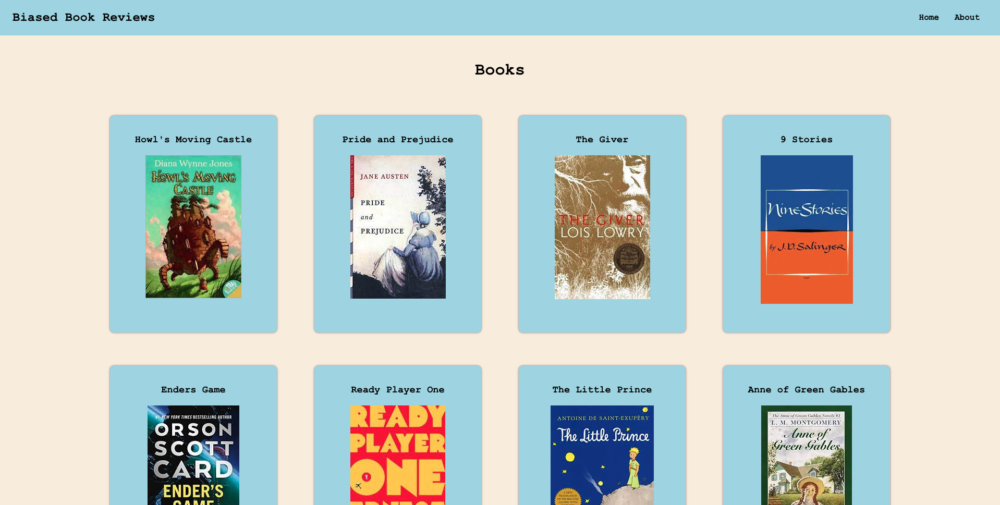
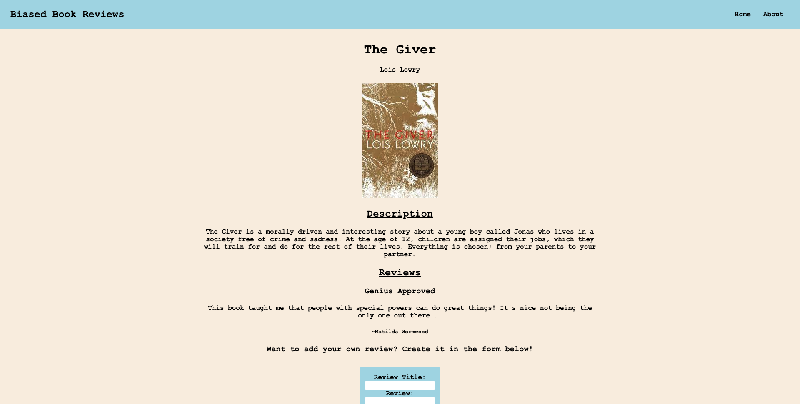
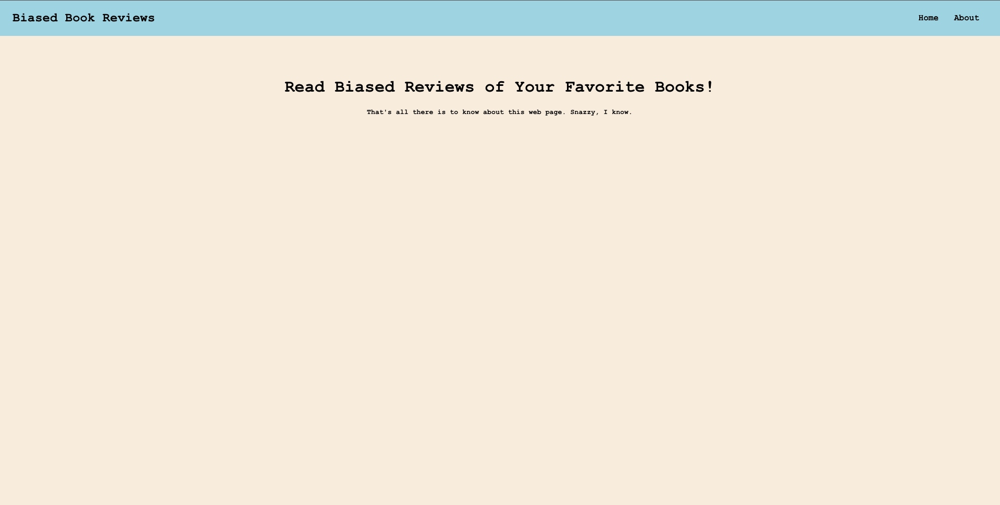

# Biased Book Reviews

### By: Marley Judd

[Github](https://github.com/marmaeju/biased_book_reviews) | [Trello](https://trello.com/invite/b/Pn8hrW8c/ATTI31aa92c893c30286e458d0e54d96fc0aF62595F2/biasedbookreviews) | [CHD](https://lucid.app/lucidchart/8796e12e-4a9e-4825-814e-3b08417da54b/edit?invitationId=inv_f456c490-ba84-46e8-ab10-35c2136e0c3d) | [Biased Book Reviews](https://biased-book-reviews.herokuapp.com/)

ERD is in the Trello

## Description

---

An app that has a database of books and book reviews. The user can look through the list of books and if the book the want does not exist, they can add their own. Once book (existing or new) is clicked, it will show the title, author, description, and any reviews that book may already have. Once inside the specific book page the user may update the book, or use the nav bar to go back to the home page with the list of all books.

## Getting Started

---

To get started create the server in the root directory, and within that directory creat a react client directory. It is there you'll write the code for the front end. Create database and connect it to backend. Create routes to enable database usage from the front end.

Create several components to differentiate an all books page, and a single book page. Use react router to navigate.

Create functions and forms to add and update a book. If you're feeling extra, do the same for reviews.

Create a function for a delete button and render it on the page of your choosing.

Add style, make it your own, and have a fun!

## Future Updates

---

Fix review form bugs, so that user can add reviews to books.

## Technologies Used

---

- MongoDB
- Mongoose
- Express
- React
- Node
- CSS

## Credits

---

Books photo cred goes to amazon.com
